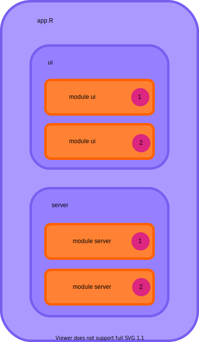

```{r setup, include=FALSE}
options(htmltools.dir.version = FALSE)
```

```{r xaringan-themer, include=FALSE, warning=FALSE}
library(xaringanthemer)
style_duo_accent(
  primary_color = "#1a5f96",
  secondary_color = "#03A696",
  code_inline_background_color = "#f8f8f8"
)
```
class: inverse, center, middle

# Better shiny code

???

- who doesn't know it? your app.R files gets longer and longer; you need to
write code repeatedly; you'd like to use this nifty functionality from the one
app you've written half a year ago in your current app...
- I'll show you how to use modules to solve these problems
- first: recap of reactive programming, then introduction to modules, pass
values to modules & return values, dynamically generate modules
- please ask questions in between, you can use the feature "raise hand"

---

# Recap: reactive programming
- usual way in `R`: procedural

```{r, eval = FALSE}
n <- 1
result <- 1 + n
n <- 2
result <- 1 + n
```

$\rightarrow$ tell what to do and when

--

- *reactive programming*: define how to do something

---

# `reactive`s
- define a rule how something is calculated

```{r, eval = FALSE}
result <- reactive({
  1 + input$n
})
```

--

- one defines rules how code is executed
- updates itself when a reactive value is changed (lazy evaluation)
- can think of a homework assignment

```{r, eval = FALSE}
latest_homework <- reactive({
  # do the homework on input$page
})
```

???

the teacher will tell the students on which page they have to do the
homework, the students don't have to check by themselves and won't do anything
until the teacher changes input$page

---

# `observe`/`observeEvent`
- monitor one/several reactive values
- reexecute the code when something changed
- can think of a student checking if the teacher is approaching

```{r, eval = FALSE}
observeEvent(input$lookout, {
  # all students back to their place
})
```

---

# Comparison
`reactive()`          | `observeEvent()`
--------------------- | ---------------------
Callable              | Not callable
Returns a value       | No return value
Lazy                  | Eager

- action with side effect: `observeEvent()`
- calculation with return value: `reactive()`

???

taken from Joe Cheng's reactivity talk, still good introduction

---

# Ways to reduce code complexity

- use a style guide (e.g. tidyverse style guide)

--

- use meaningful names, e.g. `ns` <  `new_students` < `table_new_students`

--

- use meaningful comments (why did you do something this way?), e.g. when you
define in `renderDT` which columns are editable by its column number, specify
the column names in the comment

--

- code reuse -> write functions

--

- document the functions -> let you help you by `roxygen2`

--

- don't put too much functionality into one function/`reactive`/`render*` call

--

- use modules

---

# What are Shiny modules?

.center[]

---

## Split your code up
.center[]

???

- split up the code into several parts with both ui and server parts and manage
the modules from the main app
- can think of it as a "mini shiny app" with a few additional nuts and bolts to
make it work

---

## General structure
main app:
.pull-left[
```{r, eval = FALSE}
# define the UI part
ui <- fluidPage(
  # other UI elements
  # ...
  # module UI
* module_UI(id = "id_1")
)

# define the server part
server <- function(input, output,
                   session) {
  # other logic
  # ...
  # module logic
* module_server(id = "id_1")
}

shinyApp(ui, server)
```
]

---

## General structure
main app:
.pull-left[
```{r, eval = FALSE}
# define the UI part
ui <- fluidPage(
  # other UI elements
  # ...
  # module UI
  module_UI(id = "id_1")
* module_UI(id = "id_2")
)

# define the server part
server <- function(input, output,
                   session) {
  # other logic
  # ...
  # module logic
  module_server(id = "id_1")
* module_server(id = "id_2")
}

shinyApp(ui, server)
```
]

.pull-right[

]

???

- here you see the UI and server part of the module being called.
The code within a module can be reused by calling it several times with different IDs
- the IDs define the namespace for the module; I will talk about this in a minute

---

## Module structure
```{r, eval = FALSE}
# define the UI part
module_UI <- function(id) {
  ns <- NS(id)
  
  tagList(
    # your UI elements here
  )
}

# define the server part
module_server <- function(id) {
  moduleServer(
    id,
    function(input, output, session) {
      # your logic here
    }
  )
}
```

???

this is what the scaffold of a module looks like

---

## Module structure
```{r, eval = FALSE}
# define the UI part
module_UI <- function(id) {
* ns <- NS(id)
  
  tagList(
    # your UI elements here
  )
}

# define the server part
module_server <- function(id) {
* moduleServer(
    id,
    function(input, output, session) {
      # your logic here
    }
  )
}
```

???

here you see the setup for the namespacing

---

## Namespacing - 1

- a namespace defines a scope for a set of names

--

- known from packages, e.g. `dplyr::filter` vs. `stats::filter`

--

- `ns <- NS(id)` generates a function that assigns a namespace for every module
instance based on its `id`
```{r, eval = FALSE}
ns <- NS("my_id")
ns("selected_col")
# my_id-selected_col
```

???

- namespace: can basically think of it as a named room that makes it possible to
reuse names, e.g. room 1 Jonas and room 2 Jonas
- now this is needed for every instance (different id) of a module

---

## Namespacing - 2

- in the `ui` part all `inputId`s/`outputId`s need to be wrapped with `ns`

```{r, eval = FALSE}
module_UI <- function(id) {
  ns <- NS(id)
  
  tagList(
    actionButton(
*     inputId = ns("start_calculation"),
      label = "calculate"
    )
  )
}

```

--

- in the `server` part **no** extra work

---
class: inverse

Livecoding: my first Shiny app


---

## Input values - 1

To input values into a module, just add arguments to the `ui` or `server` function

```{r, eval = FALSE}
calculate_UI <- function(id, button_label) { #<<
 ns <- NS(id)
  
  tagList(
    actionButton(
      inputId = ns("calculate"),
      label = paste0("calculate ", button_label)
    )
  )
}
```

---

## Input values - 2

```{r, eval = FALSE}
table_server <- function(id, data) { #<<
  moduleServer(
    id,
    function(input, output, session) {
      output$table_1 <- renderTable({
        data
      })
    }
  )
}
```

--

How to pass *reactive objects* and return values see more later

???

later I will go into more detail about how to communicate with modules

---

## When to use modules?

- you need **both** the `ui` and `server` part

--

- you want to test parts of your reactivity with `testServer`

--

- if you want to encapsulate code that only lives on the `ui` side or `server`
side, simple functions are fine

???

while for `server` code, it's easier to write functions that don't have `reactive`s
as inputs/outputs, otherwise it can get a bit complicated

---
class: inverse

Exercise 1: write your first module

---

# Module communication

- pass `reactive`s as inputs to modules
- return `reactive`s as output of modules

---

## `reactive` inputs - 1
What's wrong with this?
```{r, eval = FALSE}
module_server <- function(id, result) {
  moduleServer(
    id,
    function(input, output, session) {
      output$text <- renderText({result})
    }
  )
}

server <- function(input, output, session) {
  test <- reactiveVal(1)
  observeEvent(input$add, {
    test(test() + 1)
  })
  module_server(id = "my_id", result = test())
}
```

---

## `reactive` inputs - 1
What's wrong with this?
```{r, eval = FALSE}
module_server <- function(id, result) {
  moduleServer(
    id,
    function(input, output, session) {
      output$text <- renderText({result})
    }
  )
}

server <- function(input, output, session) {
  test <- reactiveVal(1)
  observeEvent(input$add, {
    test(test() + 1)
  })
* module_server(id = "my_id", result = test())
}
```

---

## `reactive` inputs - 2
.center[Always input **unevaluated** reactive values into modules!]

???

I can't stress this enough, if you only take one message with you from the
tutorial, then this!

---

## `reactive` inputs - 3

```{r, eval = FALSE}
server <- function(input, output, session) {
  test <- reactiveVal(1)
  morevals <- reactiveValues(test = 1)
  
  module_server(id = "id_1", result = test)   # works
  module_server(id = "id_2", result = test()) # doesn't work
  
  module_server(id = "id_3", result = morevals)      # works
  module_server(id = "id_4", result = morevals$test) # doesn't work
  
  module_server(id = "id_5",
                result = reactive({input$test}))  # works
  module_server(id = "id_6", result = input$test) # doesn't work
  
}
```


???

- reactives are just functions, and when you evaluate them they determine their
current value (therefore you need the brackets)
- this means that just input the name of the reactive without the brackets
- `input$name` is a special case

---

## `reactive` inputs - 4
You need to correctly evaluate the reactive value in the module:

```{r, eval = FALSE}
# reactiveVal
module_server <- function(id, result) {
  moduleServer(
    id,
    function(input, output, session) {
      output$text <- renderText({result()}) #<<
    }
  )
}

server <- function(input, output, session) {
  test <- reactiveVal(1)
  observeEvent(input$add, {
    test(test() + 1)
  })
  module_server(id = "my_id", result = test) #<<
}
```

---

## `reactive` inputs - 5
You need to correctly evaluate the reactive value in the module:

```{r, eval = FALSE}
# reactiveValues
module_server <- function(id, result) {
  moduleServer(
    id,
    function(input, output, session) {
      output$text <- renderText({result$test}) #<<
    }
  )
}

server <- function(input, output, session) {
  morevals <- reactiveValues(test = 1)
  observeEvent(input$add, {
    morevals$test <- morevals$test + 1
  })
  module_server(id = "my_id", result = morevals) #<<
}
```

---

## `reactive` inputs - 6
You need to correctly evaluate the reactive value in the module:

```{r, eval = FALSE}
# input
module_server <- function(id, result) {
  moduleServer(
    id,
    function(input, output, session) {
      output$text <- renderText({result()}) #<<
    }
  )
}

server <- function(input, output, session) {

  module_server(id = "my_id", result = reactive({input$test})) #<<
}
```

---
class: inverse

Exercise 2: reactive inputs

---

## Output values from modules - 1

Use `return` in the module and assign the value in the calling environment:

```{r, eval = FALSE}
module_server <- function(id) {
  moduleServer(
    id,
    function(input, output, session) {
      module_val <- reactiveVal(10)
      return(module_val) #<<
    }
  )
}

server <- function(input, output, session) {

  res_from_module <- module_server(id = "my_id") #<<
  output$text <- renderText({res_from_module()}) #<<
}
```

Again: only return **unevaluated** `reactive`s

???

- the same as for inputs: reactives needs to be unevaluated

---

## Output values from modules - 2

- for more return values use `list`
- elements from `input` need to be wrapped in `reactive`

```{r, eval = FALSE}
module_server <- function(id) {
  moduleServer(
    id,
    function(input, output, session) {
      return(
        list(
          a = reactive({input$a}), #<<
          b = reactive({input$b}) #<<
        ))
    }
  )
}
server <- function(input, output, session) {
  
  res_from_module <- module_server(id = "my_id") #<<
  output$text <- renderText({
    res_from_module$a() + res_from_module$b() #<<
  })
}
```

---
class: inverse

Exercise 3: reactive outputs

---
class: inverse, center, middle

# Break

---

# Dynamically add modules

- need to add both `server` and `ui` parts
- in `observeEvent`:
  - call module server function
  - add module ui with `insertUI`
- `insertUI` adds a `ui` part to a certain place on the page


```{r, eval = FALSE}
server <- function(input, output, session) {
  observeEvent(input$add_module, {
    module_server(id = paste0("id_", input$add_module)) #<<
    insertUI(
      selector = "#add_here", #<<
      ui = module_UI(id = paste0("id_", input$add_module)) #<<
    )
  })
}
```


???

- `insertUI` needs a selector where the UI gets added -> more on next slide 
- the easiest part is to place a `div` with an `id` in the main app `ui` (see exercise)

---

## `insertUI`/`removeUI`

- the `selector` tells where to add the UI
- shiny uses jQuery -> jQuery selector syntax
- easiest: `#myid` where `myid` is the `id` of a HTML element, e.g. from `fluidPage`
or extra `div(id = "myid")` in the UI
- can make sense to wrap the complete module UI in a `div` instead of `tagList`:
```{r, eval = FALSE}
module_UI <- function(id) {
  ns <- NS(id)
  div(
    id = id,
    # your UI elements here
  )
}
```

- `where`: where to place the UI relative to the selector

???

- tell the functions where to add the UI
- for modules I find it the easiest to define a `div` in the main app where
the modules are added
- wrap module UI in `div` so that the complete UI can be accessed by the UI
(important for removal)
- important: `removeUI` does not remove any observers registered from the module
 code which can be a performance problem if too many modules were added
- would need more sophisticated methods for this, don't have time to address it

---
class: inverse

- exercise 4: dynamically add modules
- exercise 5: dynamically remove modules

---

## Store outputs of generated modules

- return unevaluated reactives from module
- store them in a `reactiveValues` object (works like a list)
- evaluate every list entry

```{r, eval = FALSE}
server <- function(input, output, session) {
  mod_results <- reactiveValues() #<<
  observeEvent(input$add_module, {
    current_id <- paste0("id_", input$add_module)
    mod_results[[current_id]] <- module_server(id = current_id) #<<
    insertUI(
      selector = "#add_here",
      ui = module_UI(id = current_id)
    )
  })
  
  test <- reactive({
    lapply(reactiveValuesToList(mod_results), #<<
           function(current_module_output) { #<<
             current_module_output() #<<
           })
  })
}
```


???

- I think that this solution is not optimal, but haven't found anything else
that works so far
- I have an example of a complete app in the examples folder

---

# Nesting

- you can & should nest modules
  - code reuse
  - modules that define bigger chunks of your app
- module UI calls within another module needs `ns`

```{r, eval = FALSE}
outer_module_UI <- function(id) {
  ns <- NS(id)
  tagList(
    inner_module_UI(id = ns("my_id")) #<<
  )
}
```


???

- nesting is good when you have some functionality you want to use in several
parts/modules
- create modules that include bigger chunks of your app (e.g. a tab/page), then
you can have other modules in this module
- SHOW example app

---

# Where does a module live?

- in `app.R` just above `ui`/`server`
- in an extra folder, `source` the scripts in the main app before calling the
main `ui`/`server` functions
- in a package

---

## API change - 1

Prior to `shiny` 1.5.0 there was a different way to write & call the `server` part

--

- current:
```{r, eval = FALSE}
module_server <- function(id) {
  moduleServer(
    id,
    function(input, output, session) {
      output$text <- renderText({"This is a new module."})
    }
  )
}

server <- function(input, output, session) {
* module_server(id = "my_new_module")
}
```

---

## API change - 2

- old:
```{r, eval = FALSE}
module_server <- function(input, output, session) {
  output$text <- renderText({"This is an old module."})
}

server <- function(input, output, session) {
* callModule(module_server, id = "my_old_module")
}
```

---

## `renderUI`  within a module

- usually no namespaceing within the module `server` needed
- exemption: `renderUI`
- access the `ns` function from the `session` object

```{r, eval = FALSE}
module_server <- function(id) {
  moduleServer(
    id,
    function(input, output, session) {
      ns <- session$ns #<<
      output$column_UI <- renderUI({
        selectInput(
          inputId = ns("column"), #<<
          label = "show column",
          choices = colnames(mtcars)
        )
      })
    }
  )
}
```

---

# What should be a module?

--

- something you repeat often (and needs UI & server)

--

- parts where the reactivity should be tested separately

--

- large self-contained parts of an app (e.g. a tab)

--

- don't wrap single UI elements in a module

---

# Summary

- don't forget `ns` in the UI

--

- always input/output **unevaluated** reactives (if something should react)

--

- to dynamically add modules: `insertUI`/`removeUI`

---
class: inverse, middle, center

# Questions?
