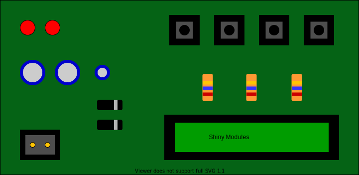
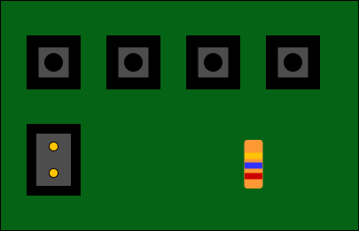
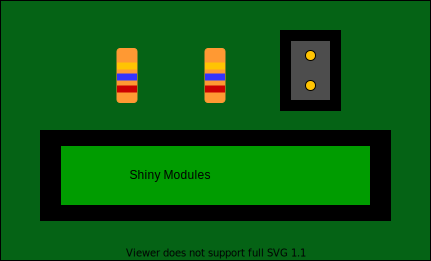
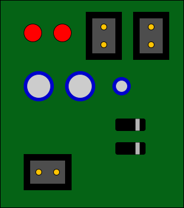

```{r setup, include=FALSE}
options(htmltools.dir.version = FALSE)
```

```{r xaringan-themer, include=FALSE, warning=FALSE}
library(xaringanthemer)
style_duo_accent(
  primary_color = "#1a5f96",
  secondary_color = "#03A696",
  code_inline_background_color = "#f8f8f8"
)
```

# Recap: reactive programming
- usual way in `R`: procedural

```{r, eval = FALSE}
n <- 1
result <- 1 + n
n <- 2
result <- 1 + n
```

$\rightarrow$ tell what to do and when

--

- *reactive programming*: define how to do something

---

# `reactive`s
- define a rule how something is calculated

```{r, eval = FALSE}
result <- reactive({
  1 + input$n
})
```

--

- one defines rules how code is executed
- updates itself when a reactive value is changed
- lazy evaluation TODO: what does it mean exactly?
- can think of a homework assignment

```{r, eval = FALSE}
latest_homework <- reactive({
  # do the homework on input$page
})
```

???

the teacher will tell the students on which page they have to do the
homework, the students don't have to check by themselves and won't do anything
until the teacher changes input$page

---

# `observe`/`observeEvent`
- monitor one/several reactive values
- reexecute the code when something changed
- can think of a student checking if the teacher is approaching

```{r, eval = FALSE}
observeEvent(input$lookout, {
  # all students back to their place
})
```

---

# Comparison
`reactive()`          | `observeEvent()`
--------------------- | ---------------------
Callable              | Not callable
Returns a value       | No return value
Lazy                  | Eager
Cached                | _N/A_

- action with side effect: `observeEvent()`
- calculation with return value: `reactive()`

???

taken from Joey Cheng's reactivity talk, still good introduction

---

# Ways to reduce code complexity

- use a style guide (e.g. tidyverse style guide)

--

- use meaningful names, e.g. `ns` <  `new_students` < `table_new_students`

--

- use meaningful comments (why did you do something this way?), e.g. when you
define in `renderDT` which columns are editable by its column number, specify
the column names in the comment

--

- code reuse -> write functions

--

- document the functions -> let you help you by `roxygen2`

--

- don't put too much functionality into one function/`reactive`/`render*` call

--

- use modules

---

# What are Shiny modules?

.center[]

---

## Split your code up
.pull-left[]
.pull-right[]
.center[]

???

- split up the code into several parts with both ui and server parts and manage
the modules from the main app
- can think of it as a "mini shiny app" with a few additional nuts and bolts to
make it work

---

## General structure
main app:
```{r, eval = FALSE}
# define the UI part
ui <- fluidPage(
  # other UI elements
  # ...
  # module UI
* module_UI("my_id")
)

# define the server part
server <- function(input, output, session) {
  # other logic
  # ...
  # module logic
* module_server("my_id")
}

shinyApp(ui, server)
```

---

## General structure
main app:
```{r, eval = FALSE}
# define the UI part
ui <- fluidPage(
  # other UI elements
  # ...
  # module UI
  module_UI("my_id")
* module_UI("another_id")
)

# define the server part
server <- function(input, output, session) {
  # other logic
  # ...
  # module logic
  module_server("my_id")
* module_server("another_id")
}

shinyApp(ui, server)
```

???

- here you see the UI and server part of the module being called.
The code within a module can be reused by calling it several times with different IDs
- the IDs define the namespace for the module; I will talk about this in a minute

---

## Module structure
```{r, eval = FALSE}
# define the UI part
module_UI <- function(id) {
  ns <- NS(id)
  
  tagList(
    # your UI elements here
  )
}

# define the server part
module_server <- function(id) {
  moduleServer(
    id,
    function(input, output, session) {
      # your logic here
    }
  )
}
```

???

this is what the scaffold of a module looks like

---

## Module structure
```{r, eval = FALSE}
# define the UI part
module_UI <- function(id) {
* ns <- NS(id)
  
  tagList(
    # your UI elements here
  )
}

# define the server part
module_server <- function(id) {
* moduleServer(
    id,
    function(input, output, session) {
      # your logic here
    }
  )
}
```

???

here you see the setup for the namespacing

---

## Namespacing

- a namespace defines a scope for a set of names

--

- known from packages, e.g. `dplyr::filter` vs. `stats::filter`

--

- `ns <- NS(id)` generates a function that assigns a namespace for every module
instance based on its `id`

--

- in the `ui` part all `inputId`s/`outputId`s need to be wrapped with `ns`

```{r, eval = FALSE}
module_UI <- function(id) {
  ns <- NS(id)
  
  tagList(
    actionButton(
*     inputId = ns("start_calculation"),
      label = "calculate"
    )
  )
}

```

--

- in the `server` part **no** extra work

---

## Input values - 1

To input values into a module, just add arguments to the `ui` or `server` function

```{r, eval = FALSE}
calculate_UI <- function(id, button_label) { #<<
 ns <- NS(id)
  
  tagList(
    actionButton(
      inputId = ns("calculate"),
      label = paste0("calculate ", button_label)
    )
  )
}
```

---

## Input values - 2

```{r, eval = FALSE}
table_server <- function(id, data) { #<<
  moduleServer(
    id,
    function(input, output, session) {
      output$table_1 <- renderTable({
        data
      })
    }
  )
}
```

--

How to pass *reactive objects* and return values see more later

???

later I will go into more detail about how to communicate with modules

---

## When to use modules?

- you need **both** the `ui` and `server` part

--

- you want to test parts of your reactivity with `testServer`

--

- if you want to encapsulate code that only lives on the `ui` side or `server`
side, simple functions are fine

???

while for `server` code, it's easier to write functions that don't have `reactive`s
as inputs/outputs, otherwise it can get a bit complicated

---

## API change - 1

Prior to `shiny` 1.5.0 there was a different way to write & call the `server` part

--

- current:
```{r, eval = FALSE}
module_server <- function(id) {
  moduleServer(
    id,
    function(input, output, session) {
      output$text <- renderText({"This is a new module."})
    }
  )
}

server <- function(input, output, session) {
* module_server(id = "my_new_module")
}
```

---

## API change - 2

- old:
```{r, eval = FALSE}
module_server <- function(input, output, session) {
  output$text <- renderText({"This is an old module."})
}

server <- function(input, output, session) {
* callModule(module_server, id = "my_old_module")
}
```

---

# Module communication

- pass `reactive`s as inputs to modules
- return `reactive`s as output of modules

---

## `reactive` inputs - 1
What's wrong with this?
```{r, eval = FALSE}
module_server <- function(id, result) {
  moduleServer(
    id,
    function(input, output, session) {
      output$text <- renderText({result})
    }
  )
}

server <- function(input, output, session) {
  test <- reactiveVal(1)
  observeEvent(input$add, {
    test(test() + 1)
  })
  module_server(id = "my_id", result = test())
}
```

---

## `reactive` inputs - 1
What's wrong with this?
```{r, eval = FALSE}
module_server <- function(id, result) {
  moduleServer(
    id,
    function(input, output, session) {
      output$text <- renderText({result})
    }
  )
}

server <- function(input, output, session) {
  test <- reactiveVal(1)
  observeEvent(input$add, {
    test(test() + 1)
  })
* module_server(id = "my_id", result = test())
}
```

---

## `reactive` inputs - 2
.center[Always input **unevaluated** reactive values into modules!]

???

I can't stress this enough, if you only take one message with you from the
tutorial, then this!

---

## `reactive` inputs - 3

```{r, eval = FALSE}
server <- function(input, output, session) {
  test <- reactiveVal(1)
  morevals <- reactiveValues(test = 1)
  
  module_server(id = "id_1", result = test)   # works
  module_server(id = "id_2", result = test()) # doesn't work
  
  module_server(id = "id_3", result = morevals)      # works
  module_server(id = "id_4", result = morevals$test) # doesn't work
  
  module_server(id = "id_5",
                result = reactive({input$test}))  # works
  module_server(id = "id_6", result = input$test) # doesn't work
  
}
```


???

- reactives are just functions, and when you evaluate them they determine their
current value (therefore you need the brackets)
- this means that just input the name of the reactive without the brackets
- `input$name` is a special case

---

## `reactive` inputs - 4
You need to correctly evaluate the reactive value in the module:

```{r, eval = FALSE}
# reactiveVal
module_server <- function(id, result) {
  moduleServer(
    id,
    function(input, output, session) {
      output$text <- renderText({result()}) #<<
    }
  )
}

server <- function(input, output, session) {
  test <- reactiveVal(1)
  observeEvent(input$add, {
    test(test() + 1)
  })
  module_server(id = "my_id", result = test) #<<
}
```

---

## `reactive` inputs - 5
You need to correctly evaluate the reactive value in the module:

```{r, eval = FALSE}
# reactiveValues
module_server <- function(id, result) {
  moduleServer(
    id,
    function(input, output, session) {
      output$text <- renderText({result$test}) #<<
    }
  )
}

server <- function(input, output, session) {
  morevals <- reactiveValues(test = 1)
  observeEvent(input$add, {
    morevals$test <- morevals$test + 1
  })
  module_server(id = "my_id", result = morevals) #<<
}
```

---

## `reactive` inputs - 6
You need to correctly evaluate the reactive value in the module:

```{r, eval = FALSE}
# input
module_server <- function(id, result) {
  moduleServer(
    id,
    function(input, output, session) {
      output$text <- renderText({result()}) #<<
    }
  )
}

server <- function(input, output, session) {

  module_server(id = "my_id", result = reactive({input$test})) #<<
}
```

---

## Output values from modules - 1

Use `return` in the module and assign the value in the calling environment:

```{r, eval = FALSE}
module_server <- function(id) {
  moduleServer(
    id,
    function(input, output, session) {
      module_val <- reactiveVal(10)
      return(module_val) #<<
    }
  )
}

server <- function(input, output, session) {

  res_from_module <- module_server(id = "my_id") #<<
  output$text <- renderText({res_from_module()}) #<<
}
```

Again: only return **unevaluated** `reactive`s

???

- the same as for inputs: reactives needs to be unevaluated

---

## Output values from modules - 2

- for more return values use `list`
- elements from `input` need to be wrapped in `reactive`

```{r, eval = FALSE}
module_server <- function(id) {
  moduleServer(
    id,
    function(input, output, session) {
      return(
        list(
          a = reactive({input$a}), #<<
          b = reactive({input$b}) #<<
        ))
    }
  )
}
server <- function(input, output, session) {
  
  res_from_module <- module_server(id = "my_id") #<<
  output$text <- renderText({
    res_from_module$a() + res_from_module$b() #<<
  })
}
```

---

# Dynamically add modules

- need to add both `server` and `ui` parts
- 2 scenarios:
  1. add modules once (probably at startup) - `lapply` is fine
  2. add modules dynamically - use `insertUI` TODO: this is not correct, module UI is always added with `insertUI`
- `insertUI` adds a `ui` part to a certain place on the page

???

- when you use `lapply` to add a certain number of modules, for example on an
`observeEvent` from an `actionButton`, this would overwrite already existing
`ui`s
- this does not happen with `insertUI` - therefore preferable

---

## Topics to discuss

- store reactive values from dynamically called modules
- better in a reactive so that you could check if any value changed

---

## `renderUI`  within a module

- usually no namespaceing within the module `server` needed
- exemption: `renderUI`
- access the `ns` function from the `session` object

```{r, eval = FALSE}
module_server <- function(id) {
  moduleServer(
    id,
    function(input, output, session) {
      ns <- session$ns #<<
      output$column_UI <- renderUI({
        selectInput(
          inputId = ns("column"), #<<
          label = "show column",
          choices = colnames(mtcars)
        )
      })
    }
  )
}
```

---

## Example plot app
```{r, eval = FALSE}
ui <- fluidPage(
  selectInput(
    inputId = "independent_var",
    label = "Independent variable",
    choices = colnames(mtcars)
  ),
  plotOutput(
    outputId = "pointplot"
  )
)

server <- function(input, output, session) {
  output$pointplot <- renderPlot({
    plot(
      x = mtcars[, input$independent_var],
      y = mtcars$mpg
    )
  })
}

shinyApp(ui, server)
```


---

Split up the Shiny app into several parts with both a `server` and a `ui` function


.left-column[]
.right-column[
```{r, eval = FALSE}
plot_UI <- function(id) {
  ns <- NS(id)
  
  tagList(
    plotOutput(
      outputId = ns("pointplot")
    )
  )
}

plot_server <- function(id, independent_var) {
  moduleServer(
    id,
    function(input, output, session) {
      output$pointplot <- renderPlot({
        plot(
          x = mtcars[, independent_var()],
          y = mtcars$mpg
        )
      })
    }
  )
}

```

]

---

The modules have a defined API to input/output objects

.center[]